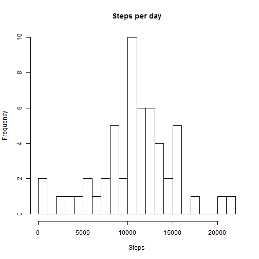
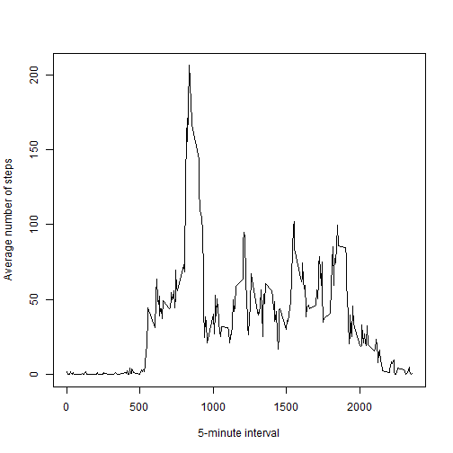
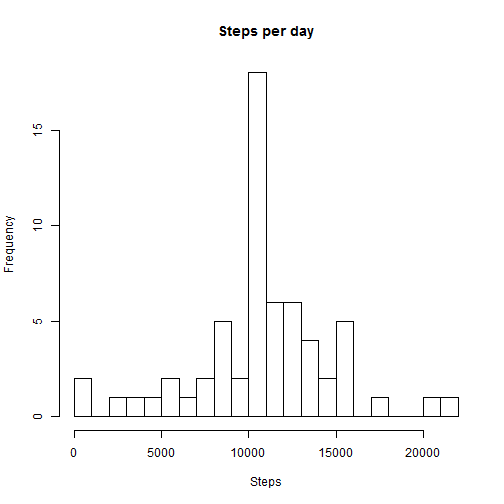
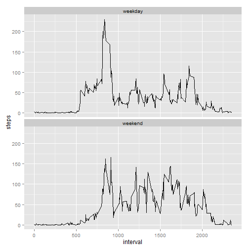

# Reproducible Research: Peer Assessment 1


## Loading and preprocessing the data

Load required libraries.

```r
    library(dplyr)
    library(ggplot2)
```


Load the file into variable data.

```r
    data <- read.csv("activity.csv", sep=",", header=TRUE, colClasses = "character")
```

Convert steps and interval to integer and date to date formats.

```r
    data$steps<-as.integer(data$steps)
    data$interval<-as.integer(data$interval)
    data$date<-as.Date(data$date)
```

## What is the average number of steps taken per day?

Histogram of the total number of steps taken each day.

```r
    dtsum<-tapply(data$steps,data$date,sum)
    hist(dtsum,breaks = 1000*(0:22), main = "Steps per day", xlab = "Steps")
```

 

The mean and median total number of steps taken per day.

```r
    # Mean
    round(mean((tapply(data$steps, data$date, sum)), na.rm = TRUE))
```

```
## [1] 10766
```

```r
    # Median
    round(median((tapply(data$steps, data$date, sum)), na.rm = TRUE))
```

```
## [1] 10765
```

## What is the average daily activity pattern?

The average daily activity pattern, averaged per 5-minute interval over all days, is shown below.

```r
    meanperinterval <- tapply(data$steps, data$interval, mean, na.rm = TRUE)
    plot(levels(factor(data$interval)), 
         meanperinterval, type = "l",
         xlab = "5-minute interval",
         ylab = "Average number of steps"
         )
```

 


The interval during the day that on average contains the maximum number of days is 835.

## Imputing missing values

This section investigate the impact on imputing data for missing values. 


```r
    missingValues <- sum(is.na(data$steps))
```

There are in total 2304 missing values in the column steps. Missing values will be filled in by the mean for the 5-minute interval.  


```r
    isna <- is.na(data$steps)                                               
    # New table with the columns interval and meanperinterval as the rounded mean per interval
    intervalmean <- cbind(as.integer(names(meanperinterval)),
                          as.integer(round(as.vector(meanperinterval))))
    colnames(intervalmean) <- c("interval", "meanperinterval")
    # "Vlookup" to get the right mean per 5-minute interval for each each record in data
    meandata <- merge(data, intervalmean, by = "interval") 
    # Order by date and interval
    meandata <- meandata[order(meandata$date, meandata$interval), ] 
    # Replace NA with the mean per 5-minute interval
    data[isna, "steps"]<- meandata[isna, "meanperinterval"]
```

Histogram of the total number of steps taken each day after imputing missing values.


```r
    dtsum<-tapply(data$steps,data$date,sum)
    hist(dtsum,breaks = 1000*(0:22), main = "Steps per day", xlab = "Steps")
```

 


```r
    # Mean
    round(mean((tapply(data$steps, data$date, sum)), na.rm = TRUE))
```

```
## [1] 10766
```

```r
    # Median
    round(median((tapply(data$steps, data$date, sum)), na.rm = TRUE))
```

```
## [1] 10762
```

The distribution is almost the same after imputing missing values, except that there are more days in the bin with the mean number of steps per day. This is due to that days that previously only had NA values now get the average number of steps per day. The mean and median are not significantly changed by the imputing missing data.

## Are there differences in activity patterns between weekdays and weekends?

The weekdays function is used to add column indicating the day of the week that the data is measured. Locale "C" is used to get english names in case of non-english system locale settings.


```r
    # Change locale to give weekdays in English
    Sys.setlocale("LC_TIME", "C")
    data$day <- weekdays(data$date)
    # Change locale back to system default
    Sys.setlocale("LC_TIME", "")
```

The plot below shows the activity patters separated into weekday and weekend data.


```r
    data$daytype <- factor(ifelse(data$day %in% c("Saturday", "Sunday"), "weekend", "weekday"))
    data2 <- data %>% 
             group_by(daytype, interval) %>%
             select(steps, interval, daytype) %>%
             summarize(steps = mean(steps))
    g <- ggplot(data2, aes(interval, steps))
    g <- g + geom_line() + facet_wrap(~daytype, ncol = 1)
    g
```

 

The activity pattern is somewhat more spread out during the weekends and the activity starts and finishes later than during weekdays.
