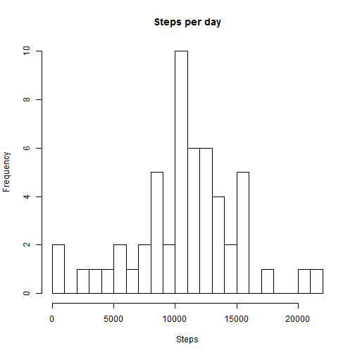
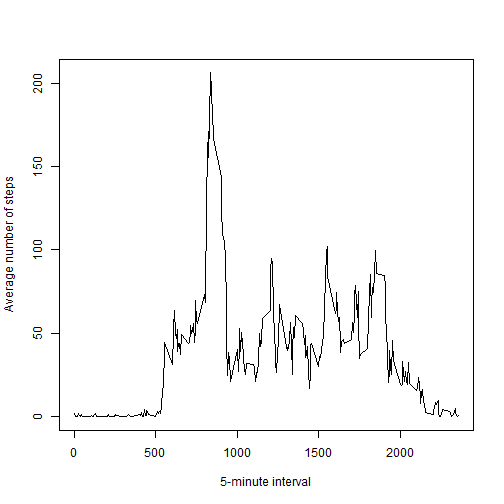
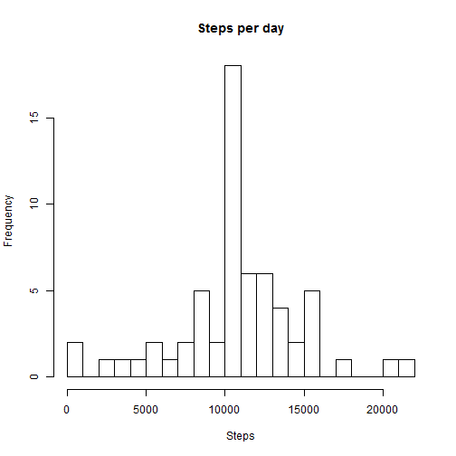
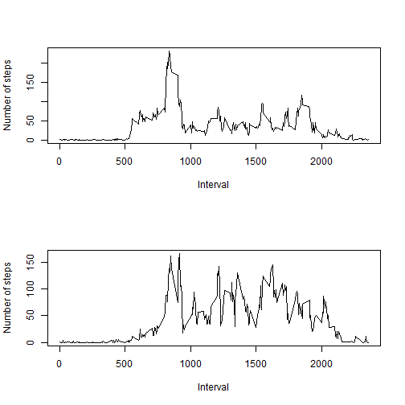

# Reproducible Research: Peer Assessment 1


## Loading and preprocessing the data

Load the file into variable data

```r
    data <- read.csv("activity.csv", sep=",", header=TRUE, colClasses = "character")
```

Convert steps and interval to integer and date to date formats

```r
    data$steps<-as.integer(data$steps)
    data$interval<-as.integer(data$interval)
    data$date<-as.Date(data$date)
```

## What is mean total number of steps taken per day?
### Histogram of the total number of steps taken each day

```r
    dtsum<-tapply(data$steps,data$date,sum)
    hist(dtsum,breaks = 1000*(0:22), main = "Steps per day", xlab = "Steps")
```

 

### Mean and median total number of steps taken per day

```r
    # Mean
    round(mean((tapply(data$steps, data$date, sum)), na.rm = TRUE))
```

```
## [1] 10766
```

```r
    # Median
    round(median((tapply(data$steps, data$date, sum)), na.rm = TRUE))
```

```
## [1] 10765
```

## What is the average daily activity pattern?

```r
    meanperinterval <- tapply(data$steps, data$interval, mean, na.rm = TRUE)
    plot(levels(factor(data$interval)), 
         meanperinterval, type = "l",
         xlab = "5-minute interval",
         ylab = "Average number of steps"
         )
```

 


```r
    maximum <- names(which.max(meanperinterval))
```

The interval during the day that on average contains the maximum number of days is 835.

## Imputing missing values
  
### Number of missing values


```r
    sum(is.na(data$steps))
```

```
## [1] 2304
```

### Missing values

Missing values will be filled in by the mean for the 5-minute interval.  


```r
    isna <- is.na(data$steps)                                               
    # New table with the columns interval and meanperinterval as the rounded mean per interval
    intervalmean <- cbind(as.integer(names(meanperinterval)),
                          as.integer(round(as.vector(meanperinterval))))
    colnames(intervalmean) <- c("interval", "meanperinterval")
    # "Vlookup" to get the right mean per 5-minute interval for each each record in data
    meandata <- merge(data, intervalmean, by = "interval") 
    # Order by date and interval
    meandata <- meandata[order(meandata$date, meandata$interval), ] 
    # Replace NA with the mean per 5-minute interval
    data[isna, "steps"]<- meandata[isna, "meanperinterval"]
```

### Histogram and mean and median of the total number of steps taken each day

```r
    dtsum2<-tapply(data$steps,data$date,sum)
    hist(dtsum2,breaks = 1000*(0:22), main = "Steps per day", xlab = "Steps")
```

 


```r
    # Mean
    round(mean((tapply(data$steps, data$date, sum)), na.rm = TRUE))
```

```
## [1] 10766
```

```r
    # Median
    round(median((tapply(data$steps, data$date, sum)), na.rm = TRUE))
```

```
## [1] 10762
```

The distribution is almost the same , except that there are more days in the bin with the mean number of steps per day. This is due to that days that previously only had NA values now get the average number of steps per day. The mean and median are not significantly changed by the imputing missing data.

## Are there differences in activity patterns between weekdays and weekends?


```r
    data$day <- weekdays(data$date)
    data$daytype <- factor(ifelse(data$day %in% c("lördag", "söndag"), "weekend", "weekday"))
    isweekend <- data$daytype == "weekend"
    wdmeanperinterval <- tapply(data$steps[!isweekend], data$interval[!isweekend], mean, na.rm = TRUE)
    wemeanperinterval <- tapply(data$steps[isweekend], data$interval[isweekend], mean, na.rm = TRUE) 
    par(mfrow = c(2,1))
    plot(levels(factor(data$interval)), 
         wdmeanperinterval, type = "l",
         xlab = "Interval",
         ylab = "Number of steps"
         )
    plot(levels(factor(data$interval)), 
         wemeanperinterval, type = "l",
         xlab = "Interval",
         ylab = "Number of steps"
         )
```

 
